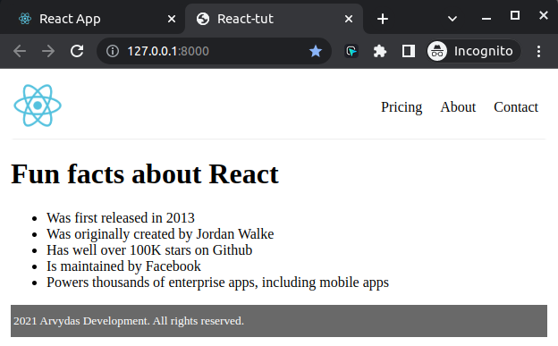

# react-tut

Link to tut - https://www.youtube.com/watch?v=bMknfKXIFA8&ab_channel=freeCodeCamp.org

## CDN-example

- `python3 http.server` to launch the server for previewing the site
- implemented live reloading every few seconds
- Using CDN to fetch react config,
- Creating some react components,
- Rendering the components on page.

