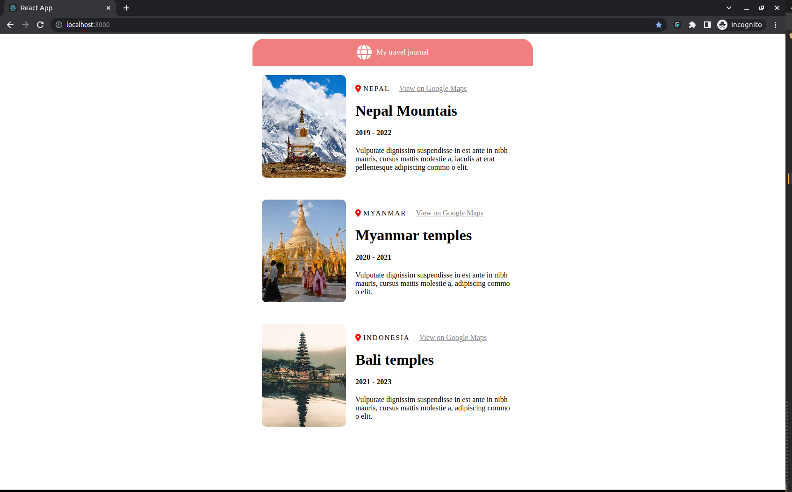

# react-tut

Link to tut - https://www.youtube.com/watch?v=bMknfKXIFA8&ab_channel=freeCodeCamp.org

## Journal

Simple travel journal

- Using `.map()` and props
- data.js file acts as database from which the data is fetched

I like this way of building sites. Especially the simplicity of a
"database". Of course it is for very small scale projects, but I can
already see myself using this priciple for quotes site or for images
site..

Also, react and it's components are quite cool.

