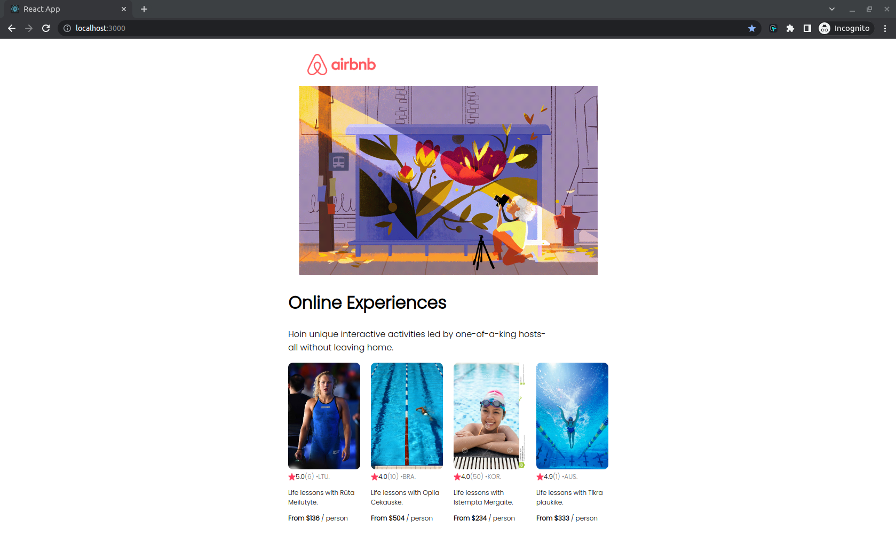

# react-tut

Link to tut - https://www.youtube.com/watch?v=bMknfKXIFA8&ab_channel=freeCodeCamp.org

## Props

- `npm start` to launch the app
- Creating `Card` component and using it as a template,
- Rendering the `Card` components by calling `Card` component 4 times
  and by hardcoding props values in each card component (too much
  manual work, not DRY).
- Creating `Publicimages` directory inside `public` folder, otherwise
  images do not render.

